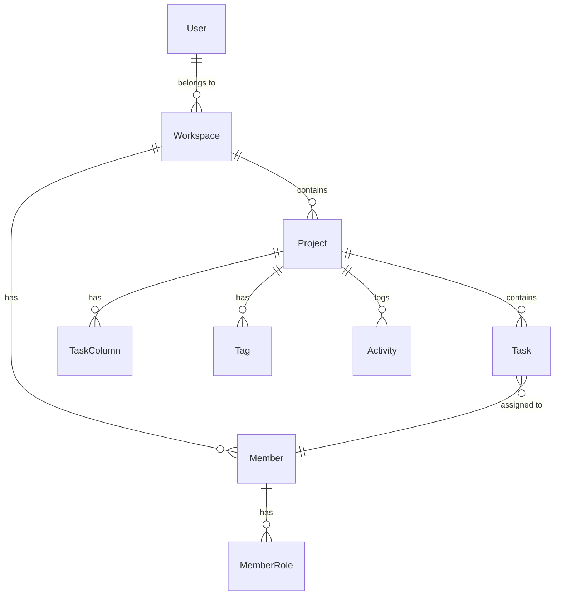

<div align="center">

# ProJam Backend

**A powerful project management backend built with Spring Boot**

[](https://openjdk.org/)
[](https://spring.io/projects/spring-boot)
[](https://www.mysql.com/)
[](https://github.com)

[Features](#-features) • [Architecture](#-architecture) • [Getting Started](#-getting-started) • [API Documentation](#-api-documentation) • [Configuration](#-configuration)

</div>

---

## 📋 Overview

**ProJam Backend** is a comprehensive project management system that enables teams to collaborate efficiently.  It provides workspace management, project tracking, task organization, real-time chat, and GitHub integration for seamless development workflows.

## ✨ Features

### 🏢 **Workspace Management**
- Create and manage multiple workspaces
- Public and private workspace support
- Invite system with join codes and links
- Member role management
- Organization-level control

### 📊 **Project Management**
- Create, update, and archive projects
- Project status tracking (Active, Completed, On-Hold)
- Task columns with drag-and-drop support
- Tag-based organization
- Project-level member permissions

### ✅ **Task Management**
- Custom task columns
- Task assignment and tracking
- Priority and status management
- Activity logging
- Progress monitoring

### 💬 **Real-Time Communication**
- WebSocket-based chat
- Project-level messaging
- Chat history retrieval
- User presence tracking

### 🔐 **Authentication & Security**
- Multiple authentication methods: 
  - Email/Password with OTP verification
  - Google OAuth 2.0
  - GitHub OAuth
- JWT-based authentication
- Refresh token support
- Secure password handling

### 🔗 **GitHub Integration**
- GitHub App integration
- Repository linking
- Automated workflows
- Installation management

### 📈 **Analytics & Reporting**
- Dashboard with project insights
- Weekly progress tracking
- Activity monitoring
- Member contribution metrics

## 🏗️ Architecture

### Tech Stack

| Component | Technology |
|-----------|-----------|
| **Framework** | Spring Boot 3.4.5 |
| **Language** | Java 21 |
| **Database** | MySQL 8.0 |
| **Security** | Spring Security + JWT |
| **Real-Time** | WebSocket (STOMP) |
| **Message Queue** | RabbitMQ |
| **Email** | Spring Mail (SMTP) |
| **Build Tool** | Maven |

### Project Structure

```
com.projam.projambackend
├── controllers/          # REST API endpoints
├── services/            # Business logic layer
├── repositories/        # Data access layer
├── models/              # JPA entities
├── dto/                 # Data transfer objects
├── jwt/                 # JWT authentication utilities
├── exceptions/          # Custom exception handlers
└── enums/               # Application enumerations
```

### Core Entities



## 🚀 Getting Started

### Prerequisites

- **Java 21** or higher
- **Maven 3.6+**
- **MySQL 8.0+**
- **RabbitMQ** (for message queuing)

### Installation

1. **Clone the repository**
   ```bash
   git clone https://github.com/rishabhrawat05/projam-backend. git
   cd projam-backend
   ```

2. **Configure environment variables**
   
   Create an `.env` file or set the following environment variables: 

   ```bash
   # Database Configuration
   DB_URL=jdbc:mysql://localhost:3306/projam
   DB_USER=your_database_user
   DB_PASS=your_database_password

   # JWT Secret
   JWT_SECRET=your_jwt_secret_key

   # Email Configuration
   MAIL_USER=your_email@gmail.com
   MAIL_PASS=your_app_password

   # GitHub OAuth
   GITHUB_CLIENT_ID=your_github_client_id
   GITHUB_CLIENT_SECRET=your_github_client_secret

   # GitHub App
   GITHUB_APP_ID=your_github_app_id
   GITHUB_PRIVATE_KEY=your_github_private_key

   # Google OAuth
   GOOGLE_CLIENT_ID=your_google_client_id

   # RabbitMQ Configuration
   RABBIT_HOST=localhost
   RABBIT_PORT=5672
   RABBIT_USER=guest
   RABBIT_PASS=guest
   RABBIT_VUSER=/

   # Application URLs
   FRONTEND_URL=http://localhost:3000
   BACKEND_URL=http://localhost:8080
   ```

3. **Build the project**
   ```bash
   ./mvnw clean install
   ```

4. **Run the application**
   ```bash
   ./mvnw spring-boot:run
   ```

   The application will start on `http://localhost:8080`

## 📡 API Documentation

### Authentication Endpoints

| Method | Endpoint | Description |
|--------|----------|-------------|
| `POST` | `/projam/auth/signup` | Register new user |
| `POST` | `/projam/auth/login` | User login |
| `POST` | `/projam/auth/verify/gmail` | Verify OTP |
| `POST` | `/projam/auth/google-login` | Google OAuth login |
| `POST` | `/projam/auth/github-login` | GitHub OAuth login |
| `POST` | `/projam/auth/token/refresh` | Refresh access token |
| `POST` | `/projam/auth/logout` | User logout |
| `GET` | `/projam/auth/validate` | Validate token |

### Workspace Endpoints

| Method | Endpoint | Description |
|--------|----------|-------------|
| `POST` | `/projam/workspace/create/workspace` | Create workspace |
| `PUT` | `/projam/workspace/update/workspace` | Update workspace |
| `DELETE` | `/projam/workspace/delete/workspace` | Delete workspace |
| `GET` | `/projam/workspace/all/workspaces` | Get user workspaces |
| `GET` | `/projam/workspace/search` | Search workspaces |
| `POST` | `/projam/workspace/join/workspace/slug` | Join via slug |
| `GET` | `/projam/workspace/join/workspace/{token}` | Join via invite link |

### Project Endpoints

| Method | Endpoint | Description |
|--------|----------|-------------|
| `POST` | `/projam/project/create` | Create project |
| `GET` | `/projam/project/get` | Get projects |
| `PUT` | `/projam/project/update-project` | Update project |
| `PUT` | `/projam/project/delete-project` | Mark for deletion |
| `PUT` | `/projam/project/restore-project` | Restore project |
| `GET` | `/projam/project/search` | Search projects |
| `POST` | `/projam/project/send-request` | Send join request |

### Task Endpoints

| Method | Endpoint | Description |
|--------|----------|-------------|
| `POST` | `/projam/task/create` | Create task |
| `GET` | `/projam/task/get-all` | Get all tasks |
| `PUT` | `/projam/task/update` | Update task |
| `DELETE` | `/projam/task/delete` | Delete task |

### Member Endpoints

| Method | Endpoint | Description |
|--------|----------|-------------|
| `POST` | `/projam/member/add` | Add member |
| `GET` | `/projam/member/get/by-workspace` | Get workspace members |
| `GET` | `/projam/member/get/by-project` | Get project members |
| `PUT` | `/projam/member/remove-from-project` | Remove member |
| `GET` | `/projam/member/suggest` | Suggest members |

### Chat Endpoints

| WebSocket | Endpoint | Description |
|-----------|----------|-------------|
| `SEND` | `/app/chat` | Send chat message |
| `GET` | `/projam/chat/history` | Get chat history |

## ⚙️ Configuration

### Application Properties

Key configuration in `src/main/resources/application.properties`:

```properties
# Server Configuration
server.port=8080

# Database
spring.jpa.hibernate.ddl-auto=update
spring.jpa.properties.hibernate.dialect=org.hibernate.dialect.MySQL8Dialect
spring.jpa.show-sql=false

# JWT
jwt.secretKey=${JWT_SECRET}

# Mail
spring.mail.host=smtp.gmail.com
spring. mail.port=587

# Profile
spring.profiles.active=prod
```

## 🔒 Security

- **JWT Authentication**: Access and refresh token mechanism
- **Password Encryption**: BCrypt password encoding
- **CORS Configuration**:  Controlled cross-origin access
- **Security Filters**: Custom JWT authentication filter
- **Role-Based Access**:  `@PreAuthorize` annotations

## 🧪 Testing

Run tests with: 

```bash
./mvnw test
```

## 📦 Deployment

### Building for Production

```bash
./mvnw clean package -DskipTests
```

The JAR file will be in `target/projambackend-0.0.1-SNAPSHOT. jar`

### Docker Deployment

```dockerfile
FROM openjdk:21-jdk-slim
WORKDIR /app
COPY target/projambackend-0.0.1-SNAPSHOT.jar app.jar
EXPOSE 8080
ENTRYPOINT ["java", "-jar", "app.jar"]
```

## 🤝 Contributing

Contributions are welcome! Please follow these steps:

1. Fork the repository
2. Create a feature branch (`git checkout -b feature/amazing-feature`)
3. Commit your changes (`git commit -m 'Add amazing feature'`)
4. Push to the branch (`git push origin feature/amazing-feature`)
5. Open a Pull Request

## 📄 License

This project is licensed under the MIT License - see the [LICENSE](LICENSE) file for details.

## 👥 Authors

**Rishabh Rawat** - [@rishabhrawat05](https://github.com/rishabhrawat05)

## 🙏 Acknowledgments

- Spring Boot Team for the excellent framework
- All contributors and supporters of this project

---

<div align="center">

**[⬆ back to top](#-projam-backend)**

Made with ❤️ by [Rishabh Rawat](https://github.com/rishabhrawat05)

</div>
